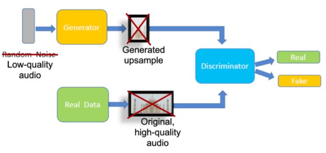
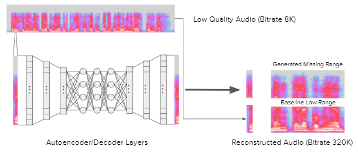

# How it works

Decibull streams high quality audio i.e. super-resolution audio from the low quality audio transmitted from your device by using General Adversarial networks (GANs). This concept of generating super resolution audio is borrowed from successful use of GANs to generate super resolution images.
A GAN comprises of two models i.e. a generator and a discriminator model which are used to resolve missing details in images/audio to generate super resolution images/audio from low quality images. Although our work is heavily inspired from existing research on using GANs 
to generate super resolution audio, most of the research has been focused on generating batch high resolution audio. Decibull attempts to use GANs to stream super resolution audio realtime.

We use the traditional GAN architecture where the generator comrises of multiple fully connected neural net layers with relu activation function. Decibull is trained on more than 80GB of speech data from multiple languages so that it can work for different speakers and volume pitch.
